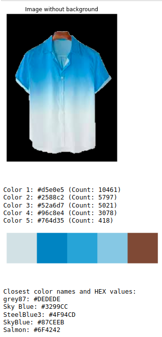

# Fashion Image Color Extraction and Matching
This notebook utilizes image processing techniques, K-means clustering for color extraction, and matches the extracted colors to the closest color names and HEX values based on a provided RGB shades dataset.

The image dataset used can be found at [Fashion Product Images (Small)](https://www.kaggle.com/datasets/paramaggarwal/fashion-product-images-small) on Kaggle.

The cleaned colour Hex values dataset can be found here: [Cleaned colour data](colours_rgb_shades_clean.csv)



## Prerequisites
Ensure you have the following libraries installed:
- Python (3.x recommended)
- pandas
- torch
- torchvision
- scikit-learn
- tqdm
- opencv-python (cv2)
- matplotlib
- 
You can install the required libraries using pip:
```python
pip install pandas torch torchvision scikit-learn tqdm opencv-python matplotlib
```

## Usage
Place your input images in a directory accessible by the script.
Update the query_image_path variable with the full path to your input image.
The script will extract colors from the input image, display the image without the background, show the sorted colors with their counts, and match the extracted colors to the closest color names and HEX values based on a provided RGB shades dataset.

## Customization
You can customize the notebook by adjusting parameters such as the number of colors to extract (default is 5), the background removal method, and the input image path.

## Files and Directories
color_extraction_matching.ipynb: Main notebook for color extraction and matching.
/data: Directory containing input images and the RGB shades dataset (colours_rgb_shades_clean.csv).
/models: Directory for storing trained models if applicable.

## Acknowledgments
The script uses K-means clustering for color extraction and relies on a provided RGB shades dataset for color matching.
Libraries such as pandas, torch, torchvision, scikit-learn, tqdm, opencv-python, and matplotlib are used for data manipulation, deep learning, image processing, and visualization.

## License
This project is licensed under the Apache License.

